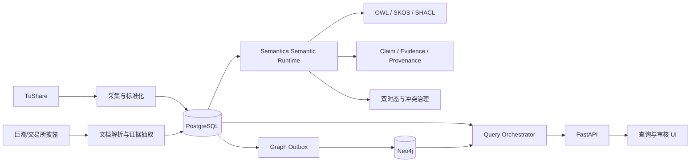

# OntologyMVP

[](https://github.com/davidchen516/ontologyMVP/actions/workflows/validate-design.yml)
[](https://github.com/davidchen516/ontologyMVP/actions/workflows/runtime-ci.yml)
[](https://github.com/davidchen516/ontologyMVP/actions/workflows/pages.yml)

本仓库代码仅用于验证本体论相关实现技术。

场景为 基于 **TuShare + Semantica + PostgreSQL + Neo4j** 的股票本体查询系统 MVP。

本仓库当前阶段用于固化可落地的技术设计，并作为后续代码实现的唯一工程基线。

> 面向外部用户的项目定位、快速开始、架构、本体、开发、验收与 FAQ，请访问 [GitHub Pages 使用说明站点](https://davidchen516.github.io/ontologyMVP/)；站点源文件位于 [`docs/`](docs/)。当前仓库尚无项目级 `LICENSE`，公开可见不等于已经授予开源许可，详见[许可证与免责声明](https://davidchen516.github.io/ontologyMVP/license-and-disclaimer.html)。

## 1. MVP 目标

首个领域选择 **A 股人形机器人产业链**，验证本体系统能否稳定回答以下问题：

1. 某只股票对应哪个上市主体、历史名称、行业和实际控制人？
2. 某家公司究竟生产哪些产品，业务处于研发、送样、小批量、量产还是已披露收入阶段？
3. 哪些公司只有东方财富/同花顺概念标签，哪些已有正式经营证据？
4. 某产业链事件会通过哪些产品和公司产生直接或二阶经营暴露？
5. 如何组合“产品/业务状态”等语义条件与经营现金流、收入、研发费用等财务条件？

首版不做股价涨跌预测，不直接生成投资建议。系统首先解决：

> 公司是谁、做什么、与谁相关、证据是什么、关系何时有效，以及为什么被查询结果命中。

## 2. 技术基线

| 能力 | 选型 | 定位 |
|---|---|---|
| 结构化主数据 | TuShare（当前账户 6420 积分） | 股票、公司、行业、概念、主营构成、财务、股东、机构调研 |
| 官方证据 | 巨潮资讯、上交所、深交所 | 年报、公告、招股书、互动回复 |
| 语义与本体运行时 | Semantica 0.7.0（实施期精确锁版） | OWL、SKOS、SHACL、双时态、溯源、冲突和图谱适配 |
| 事实主库 | PostgreSQL + pgvector | 原始数据、标准实体、Claim、Evidence、财务计算、任务状态 |
| 图查询投影 | Neo4j | 多跳关系、路径解释、产业链查询 |
| 服务接口 | FastAPI | 查询、筛选、审核和管理 API |
| 一致性 | Transactional Outbox | PostgreSQL 到 Neo4j 的可靠投影 |

## 3. 总体架构



## 4. 核心设计原则

1. **PostgreSQL 是事实主库**；Neo4j 是可随时重建的查询投影。
2. **Semantica 是可替换的语义内核**；业务代码只依赖项目自定义 `SemanticRuntime` 接口。
3. **Claim 是一等对象**；经营事实不能只保存为一条无来源图边。
4. **平台概念、经营事实、推理结论严格分层**。
5. **未知不等于没有**；未发现披露时返回“证据不足”，而不是直接返回否定。
6. **业务有效时间和系统记录时间分离**，支持历史时点查询。
7. **LLM 不直接写数据库，不直接执行自由 SQL/Cypher**；先输出受控 `QueryPlan` 或候选 Claim。
8. **所有经营结论必须可回溯到来源、证据片段和抽取过程**。

## 5. 文档目录

### 架构与开发设计

- [总体架构](docs/architecture.md)
- [领域与数据模型](docs/domain-model.md)
- [TuShare 与数据接入](docs/data-sources-and-ingestion.md)
- [Semantica 集成设计](docs/semantica-integration.md)
- [查询与 API 设计](docs/query-and-api.md)
- [数据库核心表结构](docs/database-schema.sql)
- [Neo4j 约束与索引](docs/neo4j-schema.cypher)
- [质量与测试方案](docs/quality-and-testing.md)
- [实施路线与验收标准](docs/delivery-plan.md)
- [ADR-0001：事实库与图投影职责](docs/adr/0001-storage-responsibilities.md)
- [ADR-0002：采用 Claim 中心模型](docs/adr/0002-claim-centered-model.md)
- [ADR-0003：Semantica 作为可替换语义运行时](docs/adr/0003-semantica-runtime-adapter.md)

### 本体与语义资产

- [本体目录说明](ontology/README.md)
- [股票核心本体](ontology/stock-core.ttl)
- [经营与产业链关系扩展](ontology/stock-relations.ttl)
- [人形机器人产品 SKOS 词表](ontology/product-skos.ttl)
- [SHACL 约束](ontology/shapes.ttl)
- [确定性推理规则](ontology/rules.yaml)
- [TuShare 字段映射](ontology/mappings/tushare.yaml)

### 自动校验

- [设计资产校验脚本](scripts/validate_design.py)
- [GitHub Actions 校验流水线](.github/workflows/validate-design.yml)
- [GitHub Pages 构建与发布流水线](.github/workflows/pages.yml)
- [文档站技术选型 ADR](docs/adr/0004-documentation-site.md)

校验覆盖：必需文件、Turtle、YAML 以及仓库内 Markdown 链接。每次向 `main` 推送及每个 Pull Request 都自动执行。

## 6. 本地启动与运行（工程基线）

工程基线提供 API、Worker、PostgreSQL(pgvector)、Neo4j 的本地依赖拓扑（对应 issue #1）。

### 前置条件

- Docker Desktop（含 Compose v2）
- 不使用 Docker 的本地开发：Python 3.11 与 [uv](https://docs.astral.sh/uv/)

### 配置（Secret 边界）

1. `cp .env.example .env` 并填入本地密码；`.env` 已被 gitignore，**真实 Secret 只通过环境变量注入，严禁提交仓库**。
2. 必填配置缺失时，API/Worker 启动即失败，并逐项列出缺失变量（不使用危险默认值）。
3. TuShare Token、LLM Key 为可选能力项：缺失时应用以 `DEGRADED` 运行、对应能力标记不可用，不伪装成可用。

### 启动与停止

```bash
docker compose up --build -d --wait   # 启动 postgres/neo4j/api/worker 并等待健康检查
docker compose ps                     # 查看服务与健康状态
docker compose logs -f api worker     # 结构化 JSON 日志（均带 trace_id）
docker compose down                   # 停止；默认保留数据卷
```

`docker compose down` 不会删除数据卷；删除卷属于显式人工操作（`docker compose down -v`），系统不会自动执行。应用启动时不执行任何隐式数据库变更。

### 健康检查

- `GET /healthz`：进程存活，恒为 200，**不隐含依赖健康**。
- `GET /readyz`：核心依赖（PostgreSQL、Neo4j）与应用配置就绪检查：
  - `OK`：核心依赖全部可用（HTTP 200）；
  - `DEGRADED`：核心可用但可选能力缺失（HTTP 200，能力标记 `UNAVAILABLE`）；
  - `FAIL`：PostgreSQL 或 Neo4j 不可达（HTTP 503，返回脱敏后的错误类型与诊断信息，不含密码/Token）。

```bash
curl -s http://localhost:8000/healthz
curl -s http://localhost:8000/readyz    # 未配置 TuShare Token 时返回 DEGRADED，属预期行为
```

### 本地开发（无 Docker 运行时）

```bash
uv sync                                      # 按 uv.lock 精确安装（Python 3.11 + semantica==0.7.0）
uv run pytest                                # 单元 + 集成测试（不依赖真实数据库）
uv run ruff check .                          # 静态检查
uv run uvicorn apps.api.main:app --port 8000 --no-access-log   # 配置来自 .env 或环境变量
uv run python -m apps.worker.main                             # Worker 同样读取 .env
```

### 日志与追踪

- 所有日志为结构化 JSON；API 请求与 Worker 执行单元统一携带 `trace_id`（可通过 `X-Trace-Id` 透传）。
- `password`/`token`/`secret`/`api_key` 等字段在日志层强制脱敏，包括异常堆栈文本与 DSN 中的凭据。

### CI

- **Validate design assets**：Turtle/YAML/链接校验（见上方徽章）。
- **Runtime CI**：锁文件安装（`uv sync --frozen`，解析失败即失败）→ ruff 静态检查 → pytest（单元+集成，故障用不可达端口注入）→ 设计资产校验 → gitleaks Secret 扫描。

## 7. 首个纵向开发切片

首个端到端场景固定为：

> 查询人形机器人概念中，哪些公司已有核心零部件量产证据，并且最近三个完整财年经营活动现金流合计为正。

处理链路：

```text
TuShare 概念成员
  -> 候选公司池
  -> TuShare 主营构成
  -> 年报/公告证据
  -> 产品与业务阶段 Claim
  -> 产品 SKOS 标准化
  -> Semantica/SHACL 校验
  -> PostgreSQL 事实落库
  -> Outbox 投影到 Neo4j
  -> PostgreSQL 财务过滤
  -> 返回推理路径、证据和数据口径
```

## 8. 当前状态

- [x] 可落地总体架构
- [x] 领域模型和 Claim/Evidence 模型
- [x] 数据源与 TuShare 接口规划
- [x] Semantica 适配方案
- [x] SQL、Cypher、本体与 SHACL 初始设计
- [x] 查询、API、质量和实施路线
- [x] 自动化设计资产校验
- [x] 可运行工程脚手架（API/Worker/Compose/CI/健康检查，见「本地启动与运行」）
- [ ] TuShare 连接器实现
- [ ] PostgreSQL/Neo4j 初始化与迁移
- [ ] 首个纵向场景开发

## 9. 参考

- Semantica: https://github.com/semantica-agi/semantica
- TuShare Pro: https://tushare.pro/
- W3C OWL: https://www.w3.org/OWL/
- W3C SHACL: https://www.w3.org/TR/shacl/
- W3C SKOS: https://www.w3.org/TR/skos-reference/
