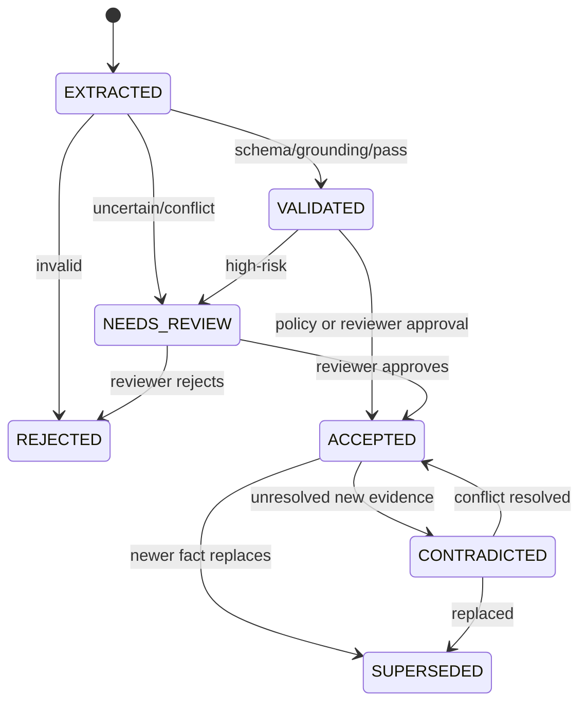

# ADR-0002：采用 Claim 中心的事实模型

- 状态：Accepted
- 日期：2026-09-28
- 决策者：ontologyMVP 项目组

## 背景

股票业务数据中，下面三句话语义完全不同：

1. 东方财富把公司列入“人形机器人概念”；
2. 公司披露正在研发机器人零部件；
3. 公司年报披露相关产品已经量产并形成收入。

如果系统只保存：

```text
Company --RELATED_TO--> HumanoidRobot
```

就会丢失：

- 关系来自谁；
- 是平台标签、公司陈述还是系统推理；
- 业务处于什么阶段；
- 什么时候有效；
- 系统什么时候获知；
- 是否有原文；
- 是否与其他来源冲突；
- 事实是否经过人工审核。

普通图边无法完整承担金融领域所需的证据和审计语义。

## 决策

1. Claim 是系统中的一等领域对象。
2. 每条经营事实表示为：

```text
(subject, predicate, object/value, time, evidence, provenance, status)
```

3. 平台分类关系、经营事实和推理结果分开保存。
4. Accepted 经营 Claim 必须有可追溯来源；文本抽取事实必须有 EvidenceFragment。
5. Claim 使用双时态：业务有效时间和系统记录时间。
6. 多来源冲突保留多个 Claim，不通过覆盖删除分歧。
7. Neo4j 可物化高频经营关系，但每条物化边必须带 `claim_id`，能够回到 Claim 和证据。
8. 推理结果必须记录输入 Claim、规则版本和推理路径，不冒充源事实。

## Claim 核心结构

```yaml
id: uuid
subject_entity_type: Company
subject_entity_id: uuid
predicate_code: PRODUCES
object_entity_type: Product
object_entity_id: uuid
business_stage: MASS_PRODUCTION
evidence_state: REVENUE_DISCLOSED
claim_status: ACCEPTED
valid_from: 2024-07-01
valid_to: null
recorded_at: 2025-04-18T09:30:00Z
superseded_at: null
confidence: 0.96
ontology_version: 0.1.0
mapping_version: 0.1.0
content_hash: sha256
```

## 状态机



正式查询默认使用 `ACCEPTED`；用户明确要求时可以展示冲突和历史版本。

## 业务阶段与证据状态分离

业务阶段：

```text
TECHNOLOGY_RESERVE
RESEARCH
PROTOTYPE
SAMPLE_VALIDATION
SMALL_BATCH
MASS_PRODUCTION
UNKNOWN
```

证据状态：

```text
PLATFORM_CLASSIFICATION_ONLY
PRODUCT_DISCLOSED
REVENUE_DISCLOSED
COMPANY_DENIAL
EVIDENCE_INSUFFICIENT
```

原因：

- `REVENUE_DISCLOSED` 是披露强度，不是生产阶段；
- `COMPANY_DENIAL` 是证据语义，不是成熟度；
- `UNKNOWN` 不表示不存在；
- 平台概念标签不能提升为经营阶段。

## 双时态

```text
valid_from / valid_to
recorded_at / superseded_at
```

示例：公司从 2024 年 7 月开始量产，但系统直到 2025 年 4 月年报发布才获知：

```text
valid_from = 2024-07-01
recorded_at = 2025-04-18
```

这使系统能够同时回答：

- 截至某个业务日期，事实是否有效；
- 在某个历史系统日期，当时已知哪些信息；
- 后续披露是否修正了旧结论。

## Evidence 与 Provenance

Claim 与证据关系：

```text
SUPPORTS
CONTRADICTS
QUALIFIES
SUPERSEDES
```

EvidenceFragment 保存：

- 文档；
- 页码；
- 章节；
- 段落和字符偏移；
- 原始引文；
- 内容 Hash；
- 可选向量。

Provenance 保存：

- 原始 API 或文档；
- 解析、抽取、标准化活动；
- 模型、Prompt、映射和本体版本；
- 自动 Agent 或人工审核人；
- 置信度和校验 Hash。

## 物化图边

为了查询性能，允许：

```text
Company -[:PRODUCES {claim_id, business_stage, valid_from, ...}]-> Product
```

但必须同时存在：

```text
Company -[:HAS_CLAIM]-> Claim
Claim -[:OBJECT]-> Product
Claim -[:SUPPORTED_BY]-> Evidence
```

禁止创建无法追溯的经营边。

## 后果

### 正面

- 能区分平台标签、企业事实和推理；
- 证据、时间和来源完整；
- 冲突可显式管理；
- 支持历史查询和修订；
- 查询结果可解释；
- 适合金融和审计场景。

### 代价

- 数据模型和查询更复杂；
- 需要审核状态机；
- 图中节点和关系数量增加；
- 每条事实都需要溯源和证据治理；
- 需要物化关系与 Claim 保持一致。

## 被否决的方案

### 方案A：所有事实直接保存为普通图边

否决原因：无法完整表达证据、冲突、状态和双时态；属性会膨胀且难以版本化。

### 方案B：只保存最终“真值”

否决原因：丢失来源差异和历史判断，无法解释为什么系统选择该结论。

### 方案C：把每份来源文本作为向量，查询时由 LLM 临时判断

否决原因：结果不可重复、成本高、无法稳定联合财务筛选，也无法形成正式事实基线。

## 验收约束

- Accepted 文本经营 Claim 证据覆盖率 100%；
- Accepted 经营图边含 `claim_id` 比例 100%；
- 平台 TAGGED_AS 不自动生成 PRODUCES；
- 未知不生成否定 Claim；
- 冲突不得静默覆盖；
- 推理结果能回溯输入 Claim 和规则版本；
- 历史 Claim 不物理删除，采用 SUPERSEDED 或 REJECTED 状态保留审计。
