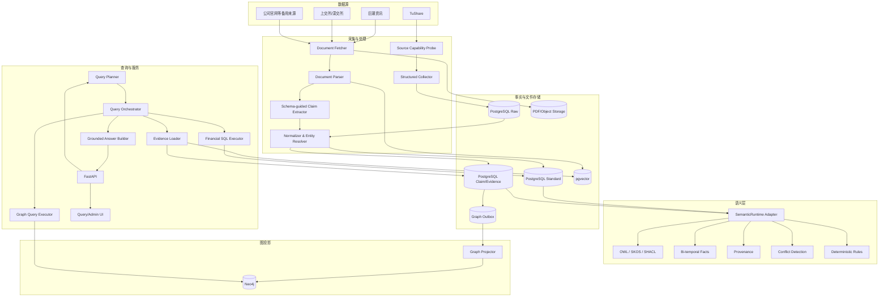

# 股票本体查询系统总体架构

## 1. 文档目的

本文定义 `ontologyMVP` 的技术架构基线，目标是让开发团队能够据此完成工程拆分、接口定义、存储设计、部署和验收。

MVP首个领域固定为 **A股人形机器人产业链**。系统不负责预测股价，而是构建一套可验证的业务事实体系，回答：

- 公司是谁、对应哪些证券；
- 公司生产、研发或否认哪些产品；
- 业务关系在什么时间有效；
- 结论来源于哪份披露、哪段原文；
- 本体条件如何与财务数值条件组合；
- 一条查询结果为什么命中，经过了哪些关系路径。

## 2. 架构判断

### 2.1 系统权威边界

| 数据/能力 | 权威组件 | 说明 |
|---|---|---|
| TuShare原始返回 | PostgreSQL Raw层 | 必须原样保存，支持重放和字段审计 |
| 公司、证券、财务标准数据 | PostgreSQL Standard层 | 结构化查询与计算的权威来源 |
| Claim、Evidence、审核状态 | PostgreSQL Fact层 | 经营事实的唯一权威来源 |
| 产品词汇、本体与约束 | Git版本化的OWL/SKOS/SHACL | 通过CI发布本体版本 |
| 多跳关系查询 | Neo4j | 查询投影，不作为唯一事实库 |
| 证据语义检索 | pgvector | 存储文档片段Embedding |
| 本体、时态、溯源与冲突能力 | Semantica适配层 | 可替换语义内核 |
| 自然语言理解 | LLM + Query Planner | 只生成受控计划，不直接访问数据库 |

### 2.2 核心原则

1. **PostgreSQL为事实主库，Neo4j为查询投影。**
2. **Claim为一等对象，经营关系不得只表现为无来源图边。**
3. **平台分类、企业披露事实和系统推理结论必须分层。**
4. **业务有效时间与系统记录时间必须分离。**
5. **Semantica通过项目适配器使用，不向业务层泄露框架内部API。**
6. **LLM只能产生候选Claim或QueryPlan，不能直接修改正式事实。**
7. **每条经营结论都必须能回到证据和原始来源。**
8. **未知不等于否定，没有证据时使用`UNKNOWN`或`EVIDENCE_INSUFFICIENT`。**

## 3. 逻辑架构



## 4. 组件职责

### 4.1 Source Capability Probe

启动和定时执行最小查询，验证TuShare各接口的真实权限与可用性。积分只作为参考，最终以探针结果为准。

输出能力矩阵：

```json
{
  "stock_basic": {"status": "AVAILABLE", "checked_at": "..."},
  "fina_mainbz_vip": {"status": "AVAILABLE", "checked_at": "..."},
  "anns_d": {"status": "SEPARATE_PERMISSION_REQUIRED", "checked_at": "..."}
}
```

状态：

- `AVAILABLE`
- `NO_PERMISSION`
- `SEPARATE_PERMISSION_REQUIRED`
- `RATE_LIMITED`
- `SCHEMA_CHANGED`
- `NETWORK_ERROR`
- `UNKNOWN`

### 4.2 Structured Collector

负责TuShare结构化接口采集。要求：

- 请求参数、响应、拉取时间、Schema版本和Hash全部记录；
- 幂等写入；
- 分页和断点续跑；
- 调用限流与指数退避；
- 原始层和标准层分离；
- 字段变化时停止自动标准化并告警。

### 4.3 Document Pipeline

负责年报、公告、招股书、机构调研和互动回复：

1. 获取文档元数据和文件；
2. 对文件计算SHA-256；
3. 提取带页码、章节、段落位置的文本；
4. 切分证据片段；
5. 使用本体约束进行候选Claim抽取；
6. 校验证据引文是否存在于原文；
7. 进入规则验证和人工审核。

### 4.4 SemanticRuntime Adapter

项目定义稳定接口：

```python
class SemanticRuntime(Protocol):
    def validate_claim(self, claim: dict) -> dict: ...
    def validate_graph(self, graph: dict) -> dict: ...
    def detect_conflicts(self, claims: list[dict]) -> list[dict]: ...
    def register_provenance(self, fact: dict) -> None: ...
    def project_fact(self, fact: dict) -> None: ...
    def query_graph(self, query: str, parameters: dict) -> list[dict]: ...
```

`SemanticaRuntimeAdapter`实现该协议，封装Semantica的Ontology、KG、Temporal、Provenance、Conflict和GraphStore模块。

### 4.5 Graph Projector

从`graph_outbox`消费事件并幂等更新Neo4j：

- 节点和边使用业务稳定ID，不使用Neo4j内部ID作为系统ID；
- 所有经营类边必须有`claim_id`；
- 每批写入后执行数量与内容抽样校验；
- 支持从PostgreSQL全量重建；
- 失败任务进入重试，超过阈值进入死信状态和人工处理。

### 4.6 Query Orchestrator

将受控`QueryPlan`拆分成三类执行：

1. **图语义过滤**：公司、产品、主题、行业、业务阶段和关系路径；
2. **财务数值过滤**：现金流、收入、毛利率、研发费用等；
3. **证据加载与解释**：返回Claim、原文、数据口径和推理路径。

### 4.7 Product Web UI

产品界面是 API 的非权威客户端，不是新的业务层：

- 使用受控 QueryPlan/Screen API，不在浏览器拼接 SQL 或 Cypher；
- 展示公司、产品、概念、财务、Claim、Evidence、双时态和推理路径；
- 对 `results/excluded/unknowns/conflicts/degradation_notes` 完整呈现；
- 图谱只加载受控子图，并提供可访问的表格/路径替代视图；
- 审核决定仍由后端状态机、权限、乐观并发和审计控制；
- 数据或能力不可用时显示空态/降级，不使用伪数据或死按钮。

产品需求见[产品界面设计](product-ui.html)，技术边界见
[ADR-0005](adr/0005-product-ui-stack.html)。

## 5. 数据流

### 5.1 结构化数据流

```text
TuShare API
  -> source_record（原始响应）
  -> 标准化映射
  -> Company/Security/Industry/Concept/FinancialObservation
  -> Claim或分类关系
  -> SHACL/规则校验
  -> PostgreSQL提交
  -> graph_outbox
  -> Neo4j投影
```

### 5.2 文档事实流

```text
公告或年报
  -> document + PDF
  -> evidence_fragment
  -> 候选Claim
  -> 原文定位校验
  -> 产品词汇映射
  -> 冲突检测
  -> SHACL校验
  -> 自动接受或人工审核
  -> Accepted Claim
  -> Neo4j投影
```

### 5.3 查询流

```text
自然语言问题
  -> 实体解析
  -> QueryPlan
  -> Schema白名单校验
  -> Neo4j语义候选筛选
  -> PostgreSQL财务过滤
  -> Claim/Evidence加载
  -> 结果一致性检查
  -> 模板化结构化回答
  -> LLM语言组织
```

## 6. 部署拓扑

MVP使用Docker Compose，最少部署：

```text
api        FastAPI查询与管理接口
worker     数据采集、文档处理、Outbox投影
postgres   Raw/Standard/Fact/Task/pgvector
neo4j      图查询投影
```

V0.2 增加：

```text
web        React/Vite 静态产品界面，仅通过 FastAPI 访问系统
```

可选：

```text
minio      PDF和解析产物对象存储
```

MVP暂不强制引入Kafka、Kubernetes、独立RDF Store、Elasticsearch或第二套向量数据库。

## 7. 事务与一致性

### 7.1 PostgreSQL本地事务

写入Claim时，在同一事务内写入：

- Claim；
- Claim-Evidence关系；
- Provenance记录；
- Graph Outbox事件；
- 审核或抽取操作日志。

### 7.2 PostgreSQL到Neo4j

采用Transactional Outbox，不做跨数据库分布式事务：

```text
BEGIN
  INSERT claim ...
  INSERT graph_outbox ...
COMMIT

Graph Worker
  SELECT ... FOR UPDATE SKIP LOCKED
  -> MERGE Neo4j
  -> read-after-write verify
  -> mark processed_at
```

### 7.3 对账

每日执行：

- Accepted Claim数与Neo4j Claim节点数；
- 经营类物化边是否全部带`claim_id`；
- 未处理Outbox数量和最长等待时间；
- PostgreSQL实体与Neo4j实体抽样Hash一致性。

## 8. 安全设计

- TuShare Token、数据库密码等只能从Secret或环境变量读取，不进入仓库；
- 查询编译器只使用参数化SQL和Cypher；
- LLM输出必须经过Pydantic、枚举和Schema白名单校验；
- 文档抓取限制允许的域名和Content-Type；
- 管理接口与查询接口分权；
- 人工审核操作记录用户、时间、前后值和理由；
- 原始文件和证据片段保留Hash，防止未检测的内容变化。
- 浏览器不接收数据库、Neo4j、TuShare 或 LLM 凭证；证据原文按不可信纯文本渲染；
- 审核写操作只有在标准认证、Reviewer 权限、CSRF、幂等和乐观并发门禁齐全时开放。

## 9. 可观测性

每次采集、抽取、图同步和查询都生成`trace_id`。

核心指标：

| 指标 | 说明 |
|---|---|
| `source_freshness_seconds` | 数据源新鲜度 |
| `ingest_success_ratio` | 采集成功率 |
| `claim_extraction_accept_ratio` | 候选Claim接受率 |
| `claim_grounding_failure_ratio` | 原文定位失败率 |
| `outbox_pending_count` | 待同步图事件数 |
| `graph_reconciliation_mismatch` | 图对账差异 |
| `query_p95_seconds` | 查询P95延迟 |
| `answer_with_evidence_ratio` | 带证据回答比例 |

## 10. MVP非功能目标

| 目标 | 验收值 |
|---|---|
| 简单公司查询P95 | 小于2秒 |
| 图谱+财务联合查询P95 | 小于5秒，不含首次LLM规划时间 |
| 经营结论证据覆盖率 | 100% |
| Accepted Claim图投影完整率 | 99.9%以上 |
| 数据采集幂等性 | 重跑不产生重复事实 |
| 图谱可恢复性 | 清空Neo4j后可由PostgreSQL重建 |
| 查询可解释性 | 每个命中结果提供路径和证据 |
| UI 无障碍 | 关键流程满足 WCAG 2.2 AA，键盘可完成查询与审核 |
| UI 响应式 | 375/768/1024/1440px 无阻塞性溢出或遮挡 |
| 图谱可用性 | 图形和等价路径表格均可回到 Claim/Evidence |

## 11. 演进路径

### MVP

单主题、30～50家公司、PostgreSQL任务队列、单Neo4j实例。

### V1

先交付 V0.2 产品研究与审核工作台，再扩展到多个产业链；增加本体版本迁移、增量公告解析和更完善的冲突治理。

### V2

扩展到全A股或多市场；引入消息队列、对象存储集群、读写分离和多租户权限；仍保持PostgreSQL事实主库和图投影职责不变。
