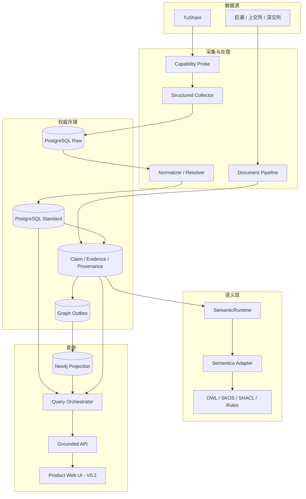

# 架构与组件

## 核心理念

1. **PostgreSQL 是事实主库。** Raw 数据、标准实体、Claim、Evidence、Provenance、审核和任务状态以 PostgreSQL 为准。
2. **Neo4j 是可重建投影。** 它负责多跳路径和图解释，不承担唯一事实权威。
3. **Claim 是一等对象。** 经营关系必须携带来源、证据、状态和时间，不能只是一条无来源图边。
4. **分类、经营事实和推理分层。** `TAGGED_AS` 不能自动变成 `PRODUCES`；推理结论不能冒充公司披露。
5. **未知不等于否定。** 没有足够证据时返回未知或证据不足。
6. **LLM 只产生候选结构。** 它不能直接写正式事实，也不能提交自由 SQL/Cypher。

## 逻辑架构



## 组件责任边界

| 组件 | 负责 | 不负责 |
|---|---|---|
| TuShare Connector | 权限探针、限流、断点续跑、Raw 原样保存 | 自动生成经营事实 |
| Document Pipeline | 官方文件版本、Hash、页码文本、EvidenceFragment | 把未校验模型输出直接接受为事实 |
| PostgreSQL + pgvector | 权威事实、财务计算、证据、任务、向量检索 | 多跳路径的主要执行 |
| `SemanticRuntime` | 项目稳定端口，隔离业务层与语义框架 | 承担业务权威状态 |
| Semantica Adapter | OWL/SHACL、双时态、Provenance、冲突与图适配 | 用默认内存状态替代生产审计库 |
| Transactional Outbox | 在事实事务中记录待投影事件 | 跨库同步双写 |
| Neo4j | 产品层级、产业路径、关系解释 | 成为唯一事实库 |
| Query Orchestrator | 验证 QueryPlan、组合图/财务/证据结果 | 执行 LLM 返回的任意 SQL/Cypher |
| Product Web UI | 查询、公司、图谱、证据、审核和运维交互 | 重新实现业务规则、直连数据库或隐藏不确定性 |

## Semantica、PostgreSQL 与 Neo4j

### Semantica

`pyproject.toml` 和 `uv.lock` 已精确锁定 `0.7.0`，项目端口边界也已建立；完整 Adapter 与真实契约测试仍由 Issue #5 跟踪。只有 Adapter 可以依赖 Semantica 内部 API。升级前必须重跑本体、SHACL、双时态、Provenance、Conflict、GraphStore 和黄金查询契约。若框架不满足契约，可在不改业务层的情况下更换实现。

### PostgreSQL

PostgreSQL 保存系统权威状态。接受一条 Claim 时，Claim 状态、Evidence 关联、Provenance、审计事件和 Outbox 必须在同一事务中全部提交或全部回滚。财务重述不得覆盖历史值。

### Neo4j

Neo4j 只接收 Outbox 投影。每条经营类边必须带 `claim_id`，重复或乱序消费要幂等；清空图数据后，应能从 PostgreSQL 全量重建并保持黄金查询结果一致。

## 关键数据流

### 结构化数据

```text
TuShare -> Raw payload -> 标准实体/财务值 -> Claim/分类关系
        -> SHACL/规则 -> PostgreSQL -> Outbox -> Neo4j
```

### 文档证据

```text
官方披露 -> 文件 Hash -> 页码文本 -> EvidenceFragment
         -> 候选 Claim -> Grounding/冲突/审核 -> Accepted Claim
```

### 查询

```text
问题 -> 受控 QueryPlan -> 图候选 -> SQL 财务过滤
     -> Claim/Evidence/Provenance -> 可解释答案
```

完整技术细节见[总体架构原文](architecture.html)、[ADR-0001](adr/0001-storage-responsibilities.html)和[ADR-0003](adr/0003-semantica-runtime-adapter.html)。
