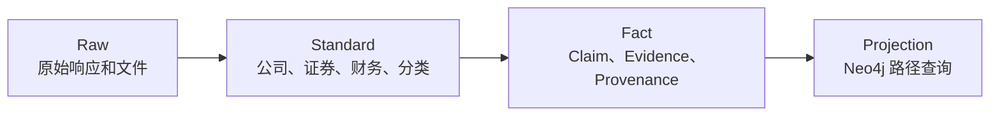
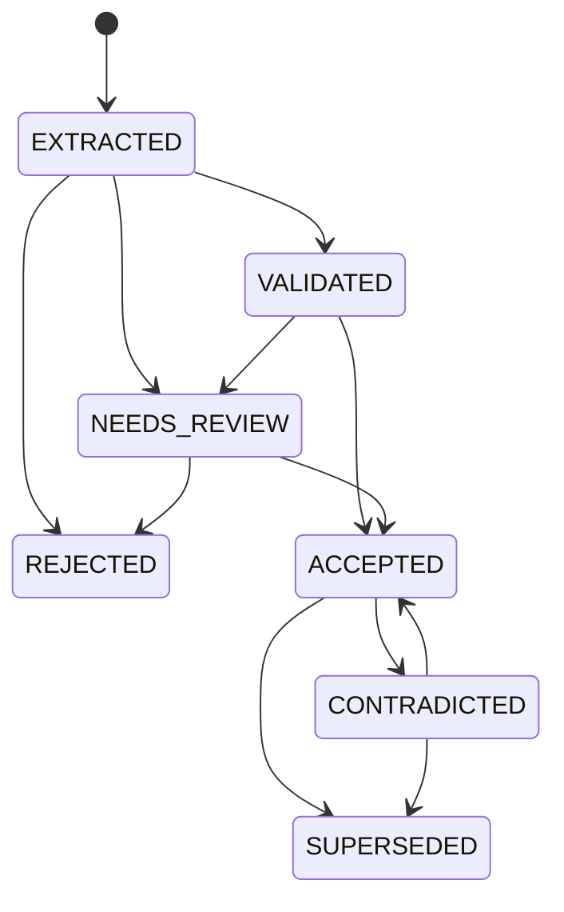

# 数据与证据模型

## 三层事实边界



- **Raw** 保留原始 Payload、请求参数、Schema 签名、Hash 和采集运行，支持重放。
- **Standard** 保存 Company、Security、Industry、Concept、Product 和 FinancialObservation 等标准实体。
- **Fact** 保存带证据、时间、状态和来源的 Claim，以及审核、冲突和溯源。
- **Projection** 从事实主库派生，可以删除并重建。

## Company 不是 Security

上市主体与证券必须分开建模：

```text
Company --ISSUES--> Security
```

证券代码、上市地和交易状态属于 Security；统一社会信用代码、实际控制人和经营主体属性属于 Company。名称相同不能作为合并实体的充分条件。

## Claim 中心模型

Claim 表示一个带状态、时间和证据的事实主张：

```text
(subject, predicate, object/value, temporal scope, evidence, provenance)
```

示例：

```yaml
subject: company:example
predicate: PRODUCES
object: product:harmonic_reducer
business_stage: MASS_PRODUCTION
evidence_state: REVENUE_DISCLOSED
status: ACCEPTED
valid_from: 2024-07-01
valid_to: null
recorded_at: 2025-04-18T09:30:00Z
confidence: 0.96
ontology_version: 0.1.0
```

### 状态机



默认正式查询只使用 `ACCEPTED`。历史 Claim 不物理删除；冲突来源并存，由显式规则或人工审核处置。

## Evidence

EvidenceFragment 是文档中的可定位片段，至少记录：

- 文档和来源系统；
- 文档版本与内容 Hash；
- 页码、章节、段落或字符偏移；
- 原始引文与片段 Hash；
- 对 Claim 的作用：`SUPPORTS`、`CONTRADICTS`、`QUALIFIES` 或 `SUPERSEDES`。

文本经营 Claim 进入 `ACCEPTED` 前，必须能在原文中定位；模型编造或无法复核的引文必须拒绝。

## Provenance

Provenance 记录事实从哪里来、经过哪些活动、由什么版本处理：

- 原始 API 或文档；
- 解析器、抽取器、Prompt、模型、映射和本体版本；
- 自动 Agent 或人工审核者；
- 输入/输出 Hash、执行时间和 `trace_id`；
- 推理规则版本与输入 Claim IDs。

生产审计不能只存在于 Semantica 的默认内存存储；权威 Provenance 必须持久化在 PostgreSQL。

## 双时态

| 时间 | 问题 | 字段示例 |
|---|---|---|
| 业务有效时间 | 现实中何时成立？ | `valid_from` / `valid_to` |
| 系统记录时间 | 系统何时获知或替代？ | `recorded_at` / `superseded_at` |

例如，公司从 2024 年 7 月开始量产，但 2025 年 4 月年报发布后系统才获知。二者必须分别保存，避免用披露日期替代业务事实发生日期。

## 必须保持的数据不变量

- 同一来源、接口与 Payload Hash 不重复进入 Raw。
- 财务缺失值不转为 0；币种未知不默认 CNY。
- 财务重述保留历史版本，当前值按明确规则选择。
- 平台概念不自动生成经营 Claim。
- `ACCEPTED` 文本 Claim 的 Evidence 和 Provenance 覆盖率为 100%。
- Claim、Evidence、Provenance、审计和 Outbox 接受事务要么全部提交，要么全部回滚。
- 每条经营类 Neo4j 边带 `claim_id`，可回到 PostgreSQL。
- `UNKNOWN` 不转换为 `FALSE`，`EVIDENCE_INSUFFICIENT` 不转换为公司否认。

完整字段与约束见[领域与数据模型](domain-model.html)、[数据库结构基线](database-schema.sql)和[ADR-0002](adr/0002-claim-centered-model.html)。
