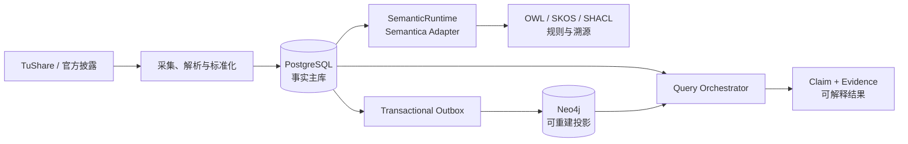

# ontologyMVP

## 让股票产业链结论回到事实、时间与证据

ontologyMVP 是一个面向 A 股产业研究的本体查询系统工程基线。它把公司、证券、产品、产业主题、财务指标和官方披露组织成可追溯的 Claim，目标不是回答“哪只股票会涨”，而是回答：

> 公司是谁、实际做什么、关系何时有效、证据在哪里，以及为什么会被查询命中。

[5 分钟了解项目](getting-started.html){: .btn .btn-primary }
[查看架构](components.html){: .btn }
[跟踪 V0.2 界面 Epic](https://github.com/davidchen516/ontologyMVP/issues/29){: .btn }

{: .warning }
**V0.1 后端闭环与 V0.2 产品界面均已交付（查询/公司/图谱/证据/审核/运维六页面）。** 仓库已经提供采集、标准化、Semantica、Claim/Evidence、Neo4j 投影、受控查询、真实数据库 CI 和合成快照验收；当前需要通过 [V0.2 产品界面](product-ui.html)把这些能力变成可供研究、核验和审核的 Web 工作台。真实 TuShare 数据仍需使用者自己的 Token 重建并验收。

## 项目价值

### 证据优先

正式经营结论必须回到文档、页码、原文片段和处理链。概念标签不能自动升级为“已量产”或“已形成收入”。

### 时间可复现

同时记录业务有效时间 `as_of` 与系统获知时间 `known_at`，支持历史时点查询、财务重述和事实修订。

### 混合查询

Neo4j 负责产品和产业链路径，PostgreSQL 负责财务数值，查询结果再装配 Claim、Evidence 与推理说明。

### 可替换边界

Semantica 通过项目自有 `SemanticRuntime` 接口接入；OWL、SKOS、SHACL 和规则保留为开放、版本化资产。

## 架构一览

这张图刻意区分权威边界：PostgreSQL 保存 Raw、标准实体、Claim、Evidence、Provenance 和任务状态；Neo4j 是为多跳路径优化的查询投影，必须能从事实主库重建。[查看组件职责与完整数据流](components.html)。

## 首个 MVP 场景

首个纵向切片聚焦 A 股人形机器人产业链：

> 找出已经量产核心零部件，并且最近三个完整财年经营活动现金流合计为正的公司。

一个合格结果不仅包含公司名称，还必须包含标准产品、业务阶段、Claim ID、来源和页码、原文、双时态、三年现金流口径、推理路径、数据新鲜度与未知项。[查看场景与示例查询](mvp-scenarios.html)。

## 从这里开始

| 你的目标 | 推荐入口 |
|---|---|
| 了解当前仓库并在本地验证 | [快速开始](getting-started.html) |
| 理解组件职责和数据边界 | [架构与组件](components.html) |
| 理解 Claim、Evidence 和双时态 | [数据与证据模型](data-and-evidence.html) |
| 阅读 OWL、SKOS 与 SHACL 资产 | [本体指南](ontology-guide.html) |
| 参与开发或提交本体变更 | [开发者指南](developer-guide.html) 与 [贡献指南](contributing.html) |
| 了解计划中的使用界面 | [产品界面设计](product-ui.html) 与 [V0.2 Roadmap](roadmap.html) |
| 判断功能何时真正完成 | [测试与验收](testing-and-acceptance.html) |
| 查看实施顺序和状态 | [Roadmap](roadmap.html) |

## 使用边界

- 本项目不预测股价，不产生买卖指令，也不提供自动交易能力。
- “未发现证据”表示 `EVIDENCE_INSUFFICIENT`，不等于业务不存在。
- 查询结果必须显示时间口径、数据新鲜度、冲突和已知限制。
- 仓库目前没有 `LICENSE` 文件；在维护者正式选择许可证前，公开可见不等于获得复制、修改或分发授权。详见[许可证与免责声明](license-and-disclaimer.html)。
