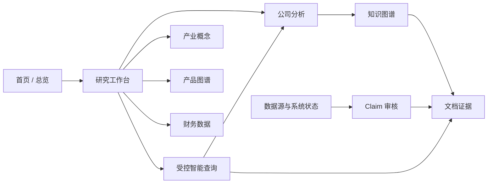

# 产品界面设计

## 1. 目标与当前边界

V0.1 已经交付可运行、可审计、可恢复的后端闭环，但用户仍需通过 JSON、脚本或数据库完成查询和审核。V0.2 增加正式产品 Web UI，使研究、证据核验、Claim 审核和运行状态检查成为可操作的产品流程。

维护者提供的浅色 Dashboard 意向图用于确定信息层级和视觉方向：顶部全局入口、左侧功能导航、首页能力概览、快速查询、产业链图谱、公司表格和黄金查询。意向图不是现状截图，其中统计、登录和自然语言查询只有在对应后端能力真实存在时才可显示为可用。

产品界面不改变以下边界：

- PostgreSQL 仍是事实权威，Neo4j 仍是可重建投影；
- UI 只消费受控 API，不直连数据库、Neo4j、TuShare 或 LLM；
- Claim、Evidence、Provenance、双时态和 QueryPlan 的判断仍在后端；
- UI 不预测股价、不提供投资建议、不连接交易接口；
- 没有证据表示 `UNKNOWN/EVIDENCE_INSUFFICIENT`，不表示业务不存在。

实施由 [V0.2 产品界面 Epic #29](https://github.com/davidchen516/ontologyMVP/issues/29) 跟踪。

## 2. 目标用户与任务

| 用户 | 核心任务 | 默认权限 |
|---|---|---|
| 研究用户 | 查询公司/产品/概念、组合财务条件、理解命中与排除原因 | 只读 |
| 证据审核者 | 核验 Claim 与原文、处理冲突、接受或拒绝候选事实 | Reviewer |
| 本地运维者 | 查看数据源、采集、标准化、图投影、对账和健康状态 | Operator；首版只读 |
| 开源使用者 | 在本机启动、加载示例快照、复现黄金查询 | 本地环境 |

## 3. 产品原则

1. **证据先于结论**：结果卡必须能展开 Claim、原文、页码、来源和推理路径。
2. **完整呈现不确定性**：`results`、`excluded`、`unknowns`、`conflicts`、`degradation_notes` 都是一级内容。
3. **真实数据或明确空态**：首页统计来自 API 并显示快照时间；不能用参考图数字或 Fixture 冒充真实运行数据。
4. **渐进披露**：先显示研究结论，再允许下钻财务口径、双时态、Provenance 和原始文档。
5. **能力感知**：后端未启用图、LLM、认证或审核写 API 时，UI 显示不可用原因，不放置死按钮。
6. **深链接与可复现**：公司、Claim、文档、证据、图路径和非敏感查询条件都可以分享链接。
7. **无障碍不是替代品**：图谱之外必须提供路径表格；状态使用文字、图标与颜色共同表达。

## 4. 信息架构

建议路由：

| 路由 | 页面 | 关键内容 |
|---|---|---|
| `/` | 首页 | 能力、真实统计、新鲜度、快捷查询、最近活动、黄金案例 |
| `/companies` | 公司搜索 | 证券/公司、概念、产品、Claim 数、数据状态 |
| `/companies/:id` | 公司详情 | 概览、财务、Claim、证据、时间线、图谱 |
| `/concepts` | 产业概念 | 平台分类与有证据经营事实的明确分层 |
| `/products/graph` | 产品图谱 | SKOS 层级、公司关系、路径与 Claim |
| `/query` | 受控查询 | QueryPlan 表单、执行解释、命中/排除/未知/冲突 |
| `/documents` | 文档证据 | 文档版本、页码片段、Claim 引用和来源 |
| `/graph` | 知识图谱 | 受控子图、关系路径、表格替代视图 |
| `/reviews` | 审核工作台 | 待审队列、证据并排、决定与审计 |
| `/operations` | 运行状态 | 数据源、采集、标准化、投影、对账、健康 |

“关于项目”和使用文档链接到 GitHub Pages，不在产品 SPA 中复制整套文档。

## 5. 视觉与交互系统

### 5.1 视觉方向

- 模式：桌面研究工作台，顶部工具栏 + 可折叠左侧导航 + 主工作区；移动端改为抽屉导航。
- 风格：克制、清晰、轻量的技术型 Dashboard；不采用金融产品常见的高刺激红绿或 AI 紫粉渐变。
- 主色：Blue `#2563EB`；辅助色使用 Teal；背景为 Slate 50/White；正文使用 Slate 900。
- 语义色：成功、警告、错误、未知和冲突均使用满足 WCAG AA 的独立 Token，并配套图标与文字。
- 字体：系统字体栈，中文优先 `Noto Sans SC`/系统黑体，基础字号 16px，正文行高至少 1.5。
- 布局：8px 间距系统，统一圆角、阴影和层级；所有图标来自同一 SVG 图标集。

参考图的网络 Hero 只可作为轻量 SVG/CSS 装饰，不能代替可操作图谱，也不能拖慢首屏。

### 5.2 全局壳层

- 顶部：品牌、全局搜索/命令入口、GitHub、主题切换、会话/权限状态。
- 侧栏：首页、公司、概念、产品图谱、财务、查询、文档证据、知识图谱、审核、数据源和系统状态。
- 导航项由服务端能力决定；无权限项可以隐藏，但直接访问仍由服务端拒绝。
- 所有核心路由支持刷新、前进/后退、书签和分享。

### 5.3 交互反馈

- 超过 300ms 的请求显示骨架或明确进度；提交期间禁用重复点击。
- 输入错误显示在字段附近；后端错误保留 `trace_id` 和恢复建议。
- 动效仅使用 `transform/opacity`，150～300ms，并遵守 `prefers-reduced-motion`。
- 破坏性或事实写操作需要确认；审核决定必须显示理由、状态变化和不可逆影响。

## 6. 关键页面需求

### 6.1 首页

- 真实公司、产品/概念、Accepted Claim、待审任务统计及快照时间；
- 快捷查询表单和黄金查询案例；
- 受控产业链摘要图，点击进入完整图谱；
- 最近采集、证据、图构建和本体版本活动；
- 核心依赖和可选能力状态；合成快照必须显著标记。

### 6.2 查询与结果

首版“智能查询”是结构化受控表单，而不是假聊天框：

- 概念、产品、业务阶段、财务指标、周期规则、阈值；
- `as_of` 和 `known_at`；
- 是否必须有 Evidence、最大结果数；
- 提交前可以查看规范化 QueryPlan；
- 自然语言 Planner 只有在真实端点上线并能预览/确认 QueryPlan 后启用。

结果页必须展示：

- 查询解释、财务口径、时间口径和数据版本；
- 命中公司及产品、业务阶段、财务明细、Claim、证据和推理路径；
- 被排除候选及原因、未知项、冲突和系统降级；
- `trace_id`、执行时间与可复现链接。

### 6.3 公司与图谱

- 公司详情按概览、产品/概念、财务、Claim、证据、时间线和图谱分栏；
- 图谱只加载受控子图，默认 1～2 跳并设置节点上限；
- 点击节点/边在侧栏显示稳定 ID、关系、Claim 状态和 Evidence；
- 图谱水位滞后或不可用时保留 PostgreSQL 事实列表并显示降级。

### 6.4 证据与审核

- 文档元数据、版本、Hash、来源 URL、页码、章节、原文片段和位置；
- Claim 与 Evidence 并排，显示 Grounding、SHACL、冲突、Provenance 和双时态；
- Reviewer 决定需要可见理由、角色校验、幂等键和乐观并发版本；
- 并发冲突返回 409 并要求刷新比较，不能最后写入者静默覆盖；
- 登录/审核写入口在标准认证和授权能力启用前保持关闭。

### 6.5 运维状态

- 能力矩阵、数据新鲜度、采集/标准化运行、拒绝记录；
- 文档下载/解析状态、Outbox 积压、图水位与对账；
- `/healthz` 与 `/readyz`；
- 首版不提供图重建、重跑采集等危险写按钮。

## 7. API 现实与缺口

当前可以直接复用：

- `POST /api/v1/query`、`POST /api/v1/screen`；
- 公司详情、Claims、时间线；
- `/admin/capabilities`、采集/标准化运行、财务、文档、Evidence、Review Tasks、Claim、投影、对账和新鲜度等只读接口；
- `/healthz`、`/readyz`。

V0.2 需要补齐受控 API：

- 首页汇总和公司搜索/分页；
- 受控图子图与路径详情；
- Claim lineage 和面向产品用户的 Evidence/文档详情；
- 审核决定写 API，包含认证、授权、If-Match/版本、幂等键和审计；
- 会话/能力发现端点，用于决定是否显示登录、自然语言和审核入口。

新增端点仍由 FastAPI 负责业务与权限，不在前端复制 SQL/Cypher 或状态机。

## 8. 页面状态契约

| 状态 | UI 行为 |
|---|---|
| Loading | 骨架/进度，保留页面结构，不抖动 |
| Empty | 说明为何为空、当前筛选和下一步，不填示例数据 |
| Validation error | 字段旁显示原因，不自动改写条件 |
| Unauthorized/Forbidden | 区分 401/403，保留返回路径，不泄露内部策略 |
| Timeout/Cancelled | 保留条件，允许安全重试；写操作先查询最终状态 |
| Degraded/Stale | 显示不可用组件、水位/新鲜度和结果影响 |
| Conflict | 展示冲突 Claim/版本；审核 409 必须刷新比较 |
| Server error | 显示 trace_id 和恢复建议，隐藏堆栈/SQL/Cypher |
| Offline/Recovered | 显示连接状态；恢复后失效缓存并重新验证 |

## 9. 响应式与无障碍

- 验证宽度：375、768、1024、1440px；移动端无横向滚动；
- 所有触控目标至少 44×44px，交互目标间距至少 8px；
- 正文对比度至少 4.5:1，可见焦点环，Tab 顺序与视觉顺序一致；
- 图表、图谱和状态不能仅靠颜色；图谱有表格/路径列表替代；
- 弹窗支持 Escape、焦点陷阱和返回焦点；
- 200% 缩放仍可完成查询和审核；
- 自动 axe 检查之外必须有人工作键盘和读屏抽查。

## 10. 安全与隐私

- 浏览器不接收数据库密码、Neo4j 凭证、TuShare Token 或 LLM Key；
- 证据原文按纯文本渲染，不执行 HTML、Markdown 中的脚本或文档指令；
- 首选同源部署；跨源时使用精确 CORS allowlist，不允许 `*` 携带凭证；
- 审核写操作需要标准 OIDC/会话、短期凭证、CSRF 防护、最小角色和服务端审计；
- URL、日志、错误、分析事件和截图不得包含 Secret 或未授权原文；
- UI 不能成为任意 SQL/Cypher、SSRF、文件下载或 Prompt Injection 的执行通道。

## 11. 非功能验收

- 产品壳和列表路由分包；Cytoscape 与可选图表按需加载；
- 首屏避免大型位图，声明资源尺寸，固定快照下 CLS < 0.1；
- 查询和图谱超时沿用后端受控预算；客户端取消不等于服务端成功取消；
- 关键流程用真实 PostgreSQL/Neo4j Compose 做 Playwright 验收；
- Vitest/Testing Library 覆盖组件和状态，axe-core 覆盖自动无障碍；
- 构建产物包含版本/commit，能回滚到上一静态产物且不回滚事实数据；
- 依赖固定版本并提交许可证清单或 SBOM；仅 CI 绿不能作为关闭条件。

## 12. 交付拆分

- [#30 前端基础与设计系统](https://github.com/davidchen516/ontologyMVP/issues/30)
- [#31 查询与公司研究工作台](https://github.com/davidchen516/ontologyMVP/issues/31)
- [#32 图谱、路径与文档证据](https://github.com/davidchen516/ontologyMVP/issues/32)
- [#33 Claim 审核与系统运营](https://github.com/davidchen516/ontologyMVP/issues/33)
- [#34 前端质量、可访问性与部署](https://github.com/davidchen516/ontologyMVP/issues/34)

技术选型和退出条件见 [ADR-0005](adr/0005-product-ui-stack.html)。
