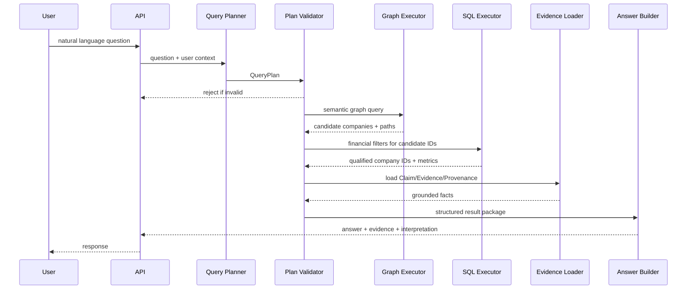

# 查询、推理与API设计

## 1. 设计目标

查询系统必须同时满足：

- 支持自然语言提问；
- 语义条件由图谱处理；
- 财务数值条件由PostgreSQL处理；
- 时间条件使用双时态语义；
- 每个结果提供命中原因、推理路径和证据；
- LLM不直接执行自由SQL或Cypher；
- 查询口径可重放、可审计、可测试。

## 2. 查询类型

首版支持：

```text
ENTITY_LOOKUP       查询公司、股票、产品、行业等实体
SEMANTIC_SCREEN     按产品、业务阶段、主题和财务条件筛选公司
EXPLAIN_RELATION    解释公司与主题/产品的关系路径
TIMELINE            查询事实随时间的变化
COMPARE             比较若干公司的业务与财务维度
EVIDENCE_SEARCH     搜索原始证据片段
```

不支持：

- 直接预测股票涨跌；
- 生成买入/卖出指令；
- 无约束的任意数据库查询；
- 将推理结果冒充公司正式披露。

## 3. QueryPlan

自然语言首先转换为受控QueryPlan。

```python
from datetime import date
from typing import Any, Literal
from pydantic import BaseModel, Field


class EntityRef(BaseModel):
    entity_type: Literal[
        "company",
        "security",
        "product",
        "product_category",
        "industry",
        "concept",
        "theme",
        "organization",
        "person",
    ]
    text: str
    resolved_id: str | None = None


class SemanticFilter(BaseModel):
    path: Literal[
        "produces",
        "develops",
        "tagged_as",
        "classified_as",
        "business_stage",
        "evidence_state",
        "controlled_by",
        "product_descendant_of",
        "theme_exposure",
    ]
    operator: Literal[
        "eq",
        "in",
        "exists",
        "not_exists",
        "descendant_of",
    ]
    value: Any


class NumericFilter(BaseModel):
    metric_code: str
    operator: Literal["gt", "gte", "lt", "lte", "eq", "between"]
    value: Any
    period_rule: Literal[
        "latest_fiscal_year",
        "latest_report_period",
        "each_of_latest_3_fiscal_years",
        "sum_of_latest_3_fiscal_years",
        "cagr_of_latest_3_fiscal_years",
    ]


class QueryPlan(BaseModel):
    intent: Literal[
        "ENTITY_LOOKUP",
        "SEMANTIC_SCREEN",
        "EXPLAIN_RELATION",
        "TIMELINE",
        "COMPARE",
        "EVIDENCE_SEARCH",
    ]
    entities: list[EntityRef] = []
    as_of: date | None = None
    known_at: date | None = None
    semantic_filters: list[SemanticFilter] = []
    numeric_filters: list[NumericFilter] = []
    max_hops: int = Field(default=2, ge=1, le=4)
    max_results: int = Field(default=20, ge=1, le=100)
    evidence_required: bool = True
    include_inferred_facts: bool = True
```

## 4. 时间语义

### 4.1 `as_of`

表示现实业务有效时间：

> 截至2024年12月31日，哪些公司已进入量产？

使用Claim的`valid_from/valid_to`过滤。

### 4.2 `known_at`

表示系统在某时点已经获知什么：

> 在2025年1月1日，当时系统已经知道哪些公司量产？

使用`recorded_at/superseded_at`过滤。

### 4.3 默认规则

- 未指定`as_of`：使用当前日期；
- 未指定`known_at`：使用当前系统知识版本；
- 所有回答显示时间口径；
- 不能用披露日期代替业务有效日期。

## 5. 查询执行流程



## 6. Planner安全边界

LLM输出必须满足：

- 只使用枚举中的Intent、Path和Operator；
- 指标代码必须存在于`financial_metric_catalog`；
- `max_hops <= 4`；
- `max_results <= 100`；
- 时间表达可解析；
- 实体经过Entity Resolver；
- 不接受LLM返回的SQL、Cypher、URL或工具调用指令。

无效计划返回澄清或受控错误，不尝试“猜测执行”。

## 7. 首个纵向查询计划

问题：

> 找出人形机器人产业链中，已经量产核心零部件，并且最近三个完整财年经营现金流合计为正的A股公司。

计划：

```json
{
  "intent": "SEMANTIC_SCREEN",
  "entities": [
    {
      "entity_type": "theme",
      "text": "人形机器人",
      "resolved_id": "theme:humanoid_robot"
    }
  ],
  "as_of": "2026-09-28",
  "semantic_filters": [
    {
      "path": "product_descendant_of",
      "operator": "descendant_of",
      "value": "product_category:humanoid_robot_core_component"
    },
    {
      "path": "business_stage",
      "operator": "in",
      "value": ["MASS_PRODUCTION"]
    }
  ],
  "numeric_filters": [
    {
      "metric_code": "NET_CASH_FLOWS_OPER_ACT",
      "operator": "gt",
      "value": 0,
      "period_rule": "sum_of_latest_3_fiscal_years"
    }
  ],
  "max_hops": 3,
  "max_results": 20,
  "evidence_required": true,
  "include_inferred_facts": true
}
```

## 8. 图查询编译

Query Compiler使用预定义模板，不接收自由Cypher。

```cypher
MATCH (c:Company)-[r:PRODUCES]->(p:Product)
MATCH (p)-[:SUBCLASS_OF*0..3]->(pc:ProductCategory)
MATCH (pc)-[:PART_OF]->(t:Theme {id: $theme_id})
MATCH (cl:Claim {id: r.claim_id})-[:SUPPORTED_BY]->(e:Evidence)
WHERE cl.status = 'ACCEPTED'
  AND cl.business_stage IN $business_stages
  AND (cl.valid_from IS NULL OR cl.valid_from <= date($as_of))
  AND (cl.valid_to IS NULL OR date($as_of) < cl.valid_to)
RETURN DISTINCT
  c.id AS company_id,
  p.id AS product_id,
  cl.id AS claim_id,
  e.id AS evidence_id,
  [c.name, 'PRODUCES', p.name, 'PART_OF', t.name] AS reasoning_path
LIMIT $candidate_limit
```

约束：

- `$theme_id`等全部参数化；
- 关系深度由白名单模板控制；
- 只查询`ACCEPTED` Claim；
- 推理关系必须返回使用的规则和输入Claim；
- 候选上限大于最终结果上限，但受系统配置约束。

## 9. 财务查询编译

财务指标目录定义：

```text
metric_code
source_dataset
source_field
unit
statement_type
allowed_period_rules
null_semantics
```

示例SQL：

```sql
WITH latest_three_years AS (
    SELECT
        company_id,
        period_end,
        value,
        ROW_NUMBER() OVER (
            PARTITION BY company_id
            ORDER BY period_end DESC
        ) AS rn
    FROM current_financial_observation
    WHERE metric_code = 'NET_CASH_FLOWS_OPER_ACT'
      AND report_period_type = 'FY'
      AND company_id = ANY(:candidate_company_ids)
)
SELECT
    company_id,
    SUM(value) AS three_year_sum,
    COUNT(*) AS year_count
FROM latest_three_years
WHERE rn <= 3
GROUP BY company_id
HAVING COUNT(*) = 3
   AND SUM(value) > :threshold;
```

回答中必须显示口径：

```text
“总体为正”解释为最近三个完整财年经营活动现金流净额合计大于0，
并不表示每个年度都为正。
```

若用户要求“连续三年均为正”，应使用`each_of_latest_3_fiscal_years`。

## 10. Evidence加载

每个命中结果至少加载：

- 命中的Claim；
- 业务阶段；
- Evidence片段；
- 文档标题、日期、页码；
- 来源等级；
- 有效时间；
- 抽取和审核状态；
- 财务Observation及报告期。

`evidence_required=true`时，没有证据的候选不得进入正式结果，但可以在`excluded`中说明：

```text
候选公司X因只有概念标签、没有量产业务证据而被排除。
```

## 11. 推理规则

首版使用确定性规则。

### 11.1 已验证主题相关

```text
Company PRODUCES Product
AND Product PART_OF Theme
AND Claim.status = ACCEPTED
AND business_stage IN [SMALL_BATCH, MASS_PRODUCTION]
=> VERIFIED_RELEVANT_TO
```

### 11.2 只有平台分类

```text
Company TAGGED_AS Concept
AND Concept RELATED_TO Theme
AND no accepted business Claim
=> CLASSIFICATION_ONLY
```

回答：

> 该公司被平台纳入相关概念，但当前未发现经过验证的经营事实。

不得回答：

> 该公司与该主题无关。

### 11.3 直接经营暴露

```text
Company PRODUCES Product
AND Product PART_OF Theme
=> DIRECT_EXPOSURE_TO Theme
```

### 11.4 二阶经营暴露

```text
Company PRODUCES Component
AND Component PART_OF Product
AND Product PART_OF Theme
=> SECOND_ORDER_EXPOSURE_TO Theme
```

所有推理结论保存：

```text
rule_id
rule_version
input_claim_ids
computed_at
valid_as_of
confidence_policy
```

## 12. Answer Builder

LLM只负责语言表达，输入必须是已验证的结构化结果包。

回答结构：

1. 查询解释和时间口径；
2. 结果列表；
3. 每家公司命中原因；
4. 产品和业务阶段；
5. 财务过滤结果；
6. 推理路径；
7. 证据原文和来源；
8. 未知项、排除项和数据新鲜度。

禁止：

- 补充结构化结果中不存在的公司；
- 将推理关系写成公司正式披露；
- 将“可能经营受益”转换为“股价将上涨”；
- 隐藏冲突或证据不足。

## 13. API设计

### 13.1 查询API

```http
POST /api/v1/query
POST /api/v1/screen
GET  /api/v1/query/{query_id}
GET  /api/v1/query/{query_id}/explanation
```

请求：

```json
{
  "question": "哪些人形机器人核心零部件公司已经量产且最近三年经营现金流合计为正？",
  "as_of": "2026-09-28",
  "known_at": null,
  "max_results": 20,
  "include_evidence": true
}
```

响应：

```json
{
  "query_id": "qry_01",
  "trace_id": "trace_01",
  "status": "SUCCEEDED",
  "interpretation": {
    "as_of": "2026-09-28",
    "cashflow_rule": "sum_of_latest_3_fiscal_years > 0",
    "business_stage": ["MASS_PRODUCTION"]
  },
  "results": [
    {
      "company_id": "company:example",
      "ts_code": "688XXX.SH",
      "company_name": "示例公司",
      "products": [
        {
          "product_id": "product:harmonic_reducer",
          "name": "谐波减速器",
          "business_stage": "MASS_PRODUCTION"
        }
      ],
      "financials": {
        "metric_code": "NET_CASH_FLOWS_OPER_ACT",
        "periods": ["2023-12-31", "2024-12-31", "2025-12-31"],
        "aggregate_value": 123456789.0,
        "currency": "CNY"
      },
      "reasoning_path": [
        "示例公司",
        "PRODUCES",
        "谐波减速器",
        "PART_OF",
        "人形机器人核心零部件"
      ],
      "evidence": [
        {
          "document_type": "ANNUAL_REPORT",
          "published_at": "2026-04-18",
          "page": 42,
          "quote": "……"
        }
      ],
      "confidence": 0.95
    }
  ],
  "excluded": [],
  "unknowns": [],
  "data_freshness": {
    "concept_snapshot": "2026-09-28",
    "financial_period": "2025-12-31",
    "ontology_version": "0.1.0"
  }
}
```

### 13.2 实体API

```http
GET /api/v1/companies/{ts_code}
GET /api/v1/companies/{ts_code}/claims
GET /api/v1/companies/{ts_code}/timeline
GET /api/v1/products/{product_id}/companies
GET /api/v1/themes/{theme_id}/companies
GET /api/v1/documents/{document_id}
GET /api/v1/claims/{claim_id}/lineage
```

### 13.3 管理API

```http
GET  /api/v1/admin/source-capabilities
POST /api/v1/admin/ingest/{dataset}
POST /api/v1/admin/documents/fetch
POST /api/v1/admin/documents/{id}/extract
POST /api/v1/admin/claims/{id}/review
POST /api/v1/admin/graph/rebuild
POST /api/v1/admin/graph/reconcile
POST /api/v1/admin/ontology/validate
GET  /api/v1/admin/data-quality
```

## 14. 错误模型

```json
{
  "error": {
    "code": "QUERY_PLAN_INVALID",
    "message": "Unsupported semantic path",
    "trace_id": "trace_01",
    "details": {
      "path": "predict_price"
    }
  }
}
```

核心错误码：

```text
ENTITY_AMBIGUOUS
ENTITY_NOT_FOUND
QUERY_PLAN_INVALID
UNSUPPORTED_METRIC
UNSUPPORTED_PERIOD_RULE
SOURCE_DATA_STALE
EVIDENCE_REQUIRED_BUT_MISSING
ONTOLOGY_VALIDATION_FAILED
GRAPH_UNAVAILABLE
FINANCIAL_DATA_INCOMPLETE
INTERNAL_CONSISTENCY_ERROR
```

## 15. 降级策略

### Neo4j不可用

- 公司基础和直接Claim查询可从PostgreSQL降级；
- 多跳筛选返回服务降级错误；
- 不伪造关系路径；
- 响应显示图数据不可用和最后同步时间。

### LLM不可用

- 支持结构化`/screen`接口；
- 对常见问题使用规则解析模板；
- 已生成QueryPlan可继续执行。

### Evidence向量不可用

- 使用Claim绑定的精确Evidence；
- 禁用开放式证据语义搜索；
- 不影响已验证查询。

## 16. 缓存

缓存键包含：

```text
normalized_query_plan_hash
as_of
known_at
ontology_version
graph_projection_version
financial_data_version
```

任何关键版本变化都使旧缓存失效。自然语言原文不是唯一缓存键。

## 17. 审计

每次查询记录：

- 用户或客户端；
- 原始问题；
- QueryPlan；
- 实体解析结果；
- SQL/Cypher模板ID和参数；
- 使用的数据版本；
- Claim和Evidence ID；
- 返回结果Hash；
- LLM模型和Prompt版本；
- 执行耗时；
- 错误或降级信息。

这样可以重放“为什么当时得到这个答案”。
