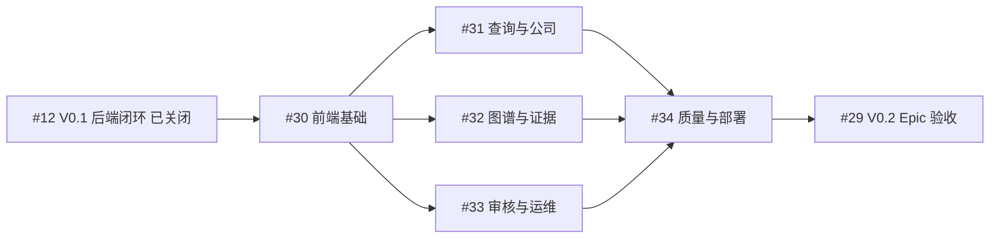

# Roadmap

V0.1 已完成，当前主线是 [V0.2 产品界面 Epic #29](https://github.com/davidchen516/ontologyMVP/issues/29)。以下是阅读友好的摘要；范围、依赖和关闭条件以各 Issue 为准。

## 当前状态

- **V0.1 已完成**：#1～#12 全部关闭，已交付采集、标准化、语义运行时、证据、Claim、图投影、受控查询、质量门禁和合成快照纵向闭环。
- **当前缺口**：没有面向用户的产品 Web UI；研究、证据核验、审核和运维仍需 API/脚本。
- **V0.2 目标**：交付可使用、可访问、可回滚的研究与审核工作台，同时补齐 UI 所需的受控 API 与认证边界。
- **真实数据门槛**：V0.1 验收快照为明确标注的合成数据；配置 TuShare Token 后仍需执行真实快照验收。

收尾证据见 [Epic 收尾报告](epic-closeout.html)与[MVP 验收报告](mvp-acceptance-report.html)。

## V0.2 依赖顺序

## V0.2 交付包

- [#30 前端工程、设计系统与应用壳](https://github.com/davidchen516/ontologyMVP/issues/30)
- [#31 查询、公司分析与 Grounded 结果研究工作台](https://github.com/davidchen516/ontologyMVP/issues/31)
- [#32 产品图谱、推理路径与文档证据浏览器](https://github.com/davidchen516/ontologyMVP/issues/32)
- [#33 Claim 审核与系统运营工作台](https://github.com/davidchen516/ontologyMVP/issues/33)
- [#34 前端可访问性、浏览器 E2E 与可回滚发布门禁](https://github.com/davidchen516/ontologyMVP/issues/34)

#31 与 #32 可在 #30 后并行；#33 的只读运营视图可以并行，但审核写操作必须等待认证/授权和最小写 API。#34 从 #30 开始持续建设，最终覆盖 #31～#33。

## V0.2 产品门槛

1. 首页统计来自真实 API 并显示快照/更新时间，不使用参考图数字；
2. 查询完整显示命中、排除、未知、冲突和降级；
3. 公司、图路径、Claim、Evidence 和原文可以端到端深链接；
4. 审核写操作具有认证、最小权限、理由、幂等、乐观并发和审计；
5. 图谱有等价表格/路径视图，关键流程达到 WCAG 2.2 AA；
6. 真实 Compose 浏览器流程、故障注入和静态产物回滚通过；仅 CI 绿不能关闭。

完整需求见[产品界面设计](product-ui.html)，技术栈见
[ADR-0005](adr/0005-product-ui-stack.html)。

## 后续演进门槛

扩大到更多产业主题或全市场前，仍需通过：

1. TuShare 与官方源可以稳定获得候选池、主营和财务数据；
2. 黄金产品映射准确率达到 95%；
3. Accepted Claim 原文定位率 100%，高风险事实不被错误自动接受；
4. 真实数据（非合成快照）上的 Precision、Recall、对账和恢复门禁；
5. 产品 UI 证明本体查询相对关键词/概念标签在准确率、解释性和时间查询上有明确增益。

详细阶段定义见[实施路线与验收标准](delivery-plan.html)。
