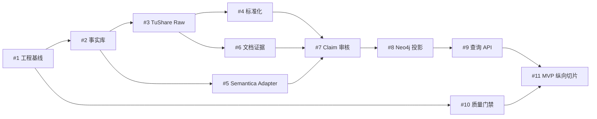

# Roadmap

Roadmap 以 [V0.1 Epic #12](https://github.com/davidchen516/ontologyMVP/issues/12) 为权威入口。以下是阅读友好的摘要；范围、依赖和关闭条件以各 Issue 为准。

## 当前状态

- 已完成：总体架构、领域模型、数据源/查询设计、OWL/SKOS/SHACL、规则、映射，以及 #1 的 API/Worker/Compose/健康检查/运行时 CI 工程基线。
- 本次加入：面向外部用户的文档站与 GitHub Pages 发布流水线。
- 尚未完成：数据库迁移、TuShare/文档连接器、Claim 业务服务、Neo4j 投影、证据化查询、真实数据闭环与端到端验收。

## 依赖顺序

## P0：工程与事实基础

- [x] [#1 初始化可运行工程、配置与本地依赖拓扑](https://github.com/davidchen516/ontologyMVP/issues/1)（已关闭）
- [#2 落地 PostgreSQL Schema、Alembic 迁移与事实事务边界](https://github.com/davidchen516/ontologyMVP/issues/2)

已采用 Python 3.11、FastAPI、PostgreSQL/pgvector、Neo4j 和 Compose 建立启动、健康检查、Secret 和可观察性基线；下一步是事实事务、迁移和数据库角色边界。

## P1：结构化数据

- [#3 TuShare 能力探针、Connector 与 Raw 幂等采集](https://github.com/davidchen516/ontologyMVP/issues/3)
- [#4 股票主数据、概念、主营构成与财务标准化](https://github.com/davidchen516/ontologyMVP/issues/4)

先验证真实权限和 Schema，再落 Raw 和标准层。空响应、无权限、限流和网络失败必须分开处理。

## P2/P3：语义、文档与 Claim

- [#5 SemanticRuntime、Semantica Adapter 与持久化 Provenance](https://github.com/davidchen516/ontologyMVP/issues/5)
- [#6 官方披露文档采集、版本化解析与 EvidenceFragment](https://github.com/davidchen516/ontologyMVP/issues/6)
- [#7 证据化 Claim 抽取、冲突与人工审核状态机](https://github.com/davidchen516/ontologyMVP/issues/7)

这组工作把文本和结构化数据转为可定位、可审核、带时间和来源的正式事实。

## P4/P5：图投影、查询与加固

- [#8 Transactional Outbox、Neo4j 幂等投影、对账与重建](https://github.com/davidchen516/ontologyMVP/issues/8)
- [#9 受控 QueryPlan、图/财务联合查询与证据化 API](https://github.com/davidchen516/ontologyMVP/issues/9)
- [#10 运行时代码 CI、契约/故障恢复测试与发布门禁](https://github.com/davidchen516/ontologyMVP/issues/10)

质量工作从 P0 开始贯穿全程，不在最后补测试。

## MVP 业务验收

- [#11 人形机器人核心零部件证据化筛选纵向切片](https://github.com/davidchen516/ontologyMVP/issues/11)

只有 #1～#10 的能力被真实串联，并通过固定数据快照、黄金查询、故障恢复和图重建，V0.1 才算完成。

## 采用门槛

扩大到更多产业主题前，必须通过四个检查点：

1. TuShare 与官方源可以稳定获得候选池、主营和财务数据；
2. 黄金产品映射准确率达到 95%；
3. Accepted Claim 原文定位率 100%，高风险事实不被错误自动接受；
4. 本体查询相对关键词/概念标签在准确率、解释性和时间查询上有明确增益。

详细阶段定义见[实施路线与验收标准](delivery-plan.html)。
